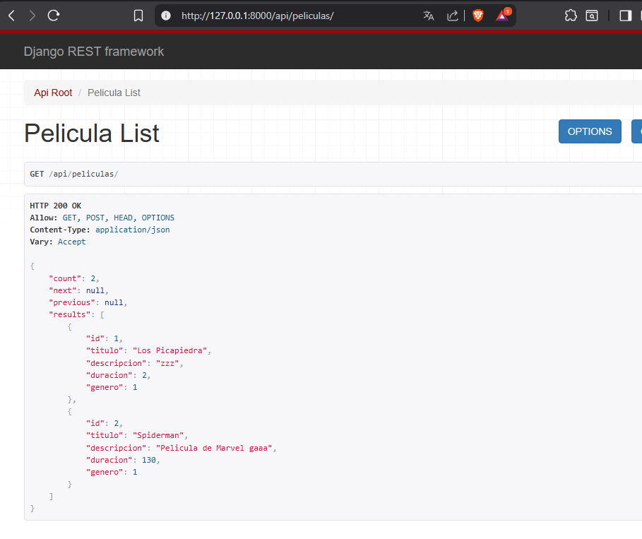
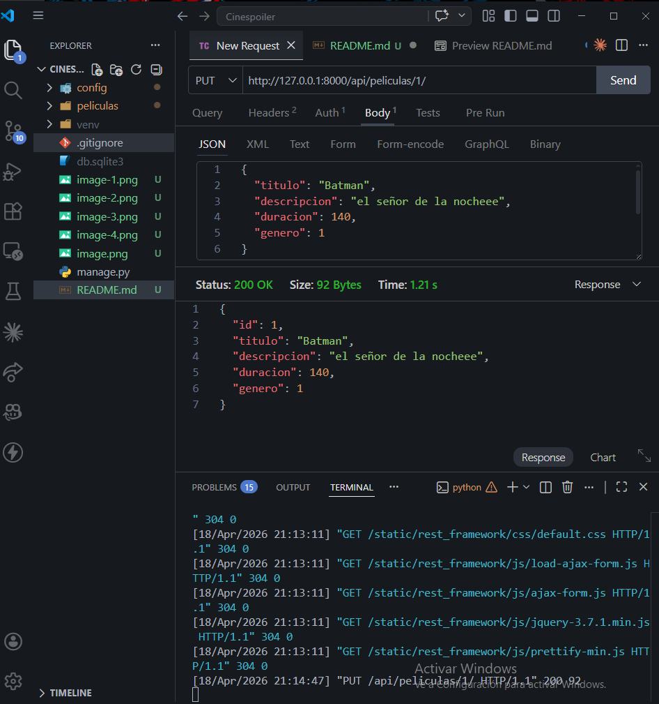
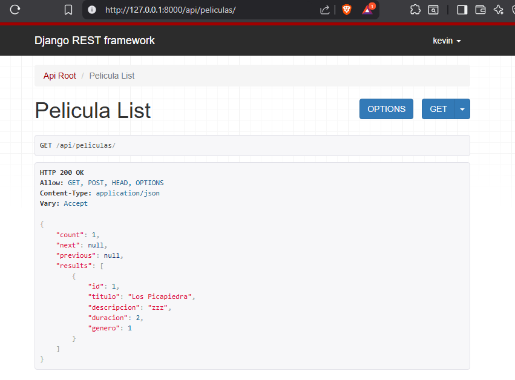
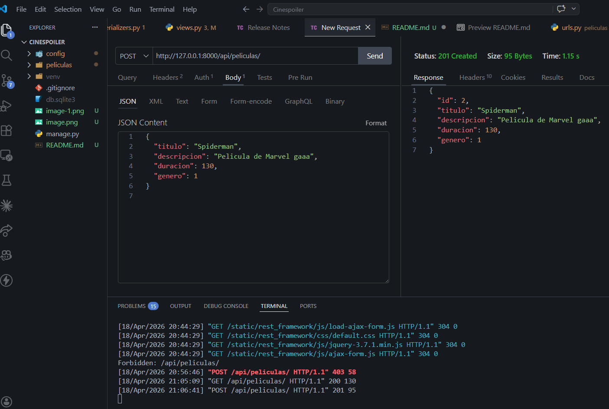
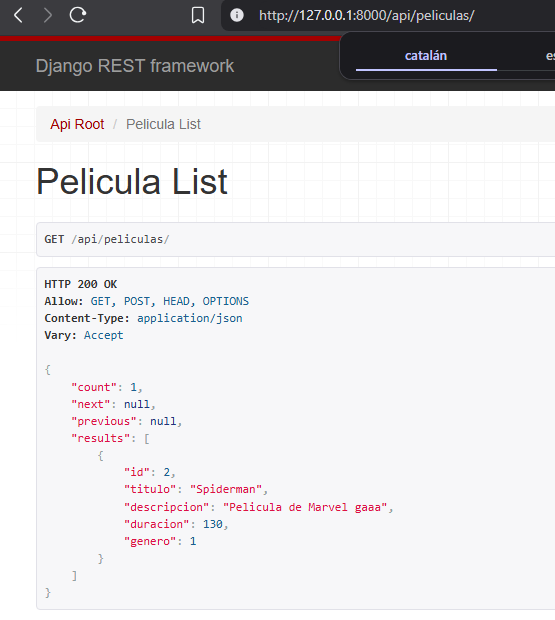

# 🎬 Lab06- Cinespoilers API

API REST desarrollada con **Django Rest Framework** para gestionar películas mediante operaciones CRUD.

## 📘 Información del curso

- **Curso:** Desarrollo de Aplicaciones Empresariales
- **Docente:** Elliot Garamendi

## 👨‍💻 Integrantes

- Kevin Quispe Ccolque
- Calep Neyra Taype
- Junior Cueva Fabian

## 🚀 Tecnologías usadas

- Python
- Django
- Django REST Framework
- SQLite
- Thunder Client

## 🔗 Endpoint principal

`GET | POST | PUT | DELETE`

`http://127.0.0.1:8000/api/peliculas/`

## 🧪 Evidencia de pruebas por integrante

---

### Kevin Quispe Ccolque

**GET**

**POST** - Se insertó un nuevo registro en la tabla de GENEROS.

**PUT** - Se actualizó una película de "terror" a "terror zombies".

**DELETE** - Se eliminó la genero "terror zombies" (`204 No Content`).

---

### Calep Neyra Taype

**GET**

**POST**

**PUT**

**DELETE**

---

### Junior Cueva Fabian

**GET**

**POST**

**PUT**

**DELETE**

