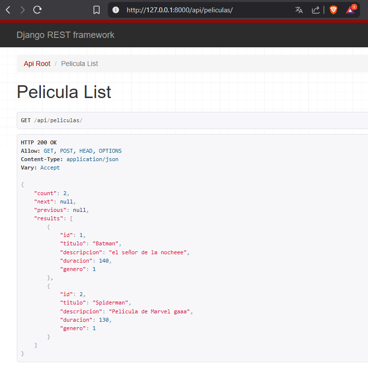
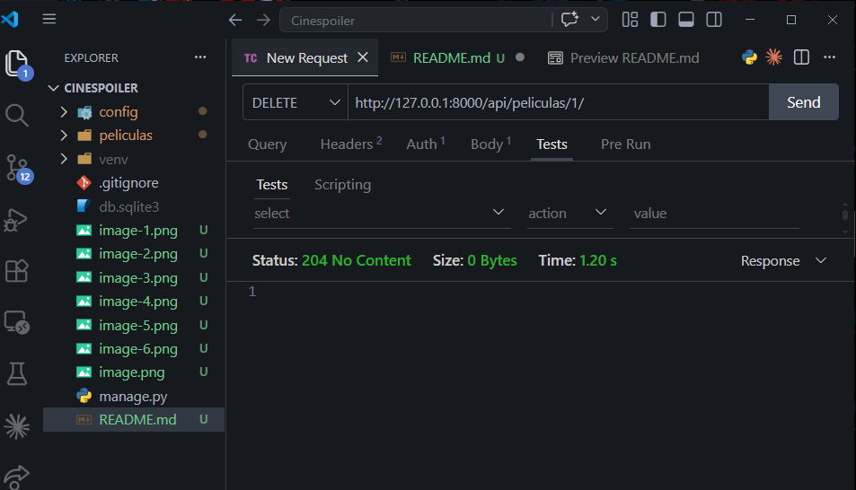

DESARROLLO DE APLICACIONES EMPRESARIALES
DOCENTE: ELLIOT GARAMENDI

Kevin Quispe Ccolque

GET
http://127.0.0.1:8000/api/peliculas/

POST: Se insertó un nuevo registro en la tabla de películas.
http://127.0.0.1:8000/api/peliculas/

PUT: Se actualizaron los datos de una película de picapiedras a batman

DELETE: Eliminamos la peli batman "NO CNONTENT"

